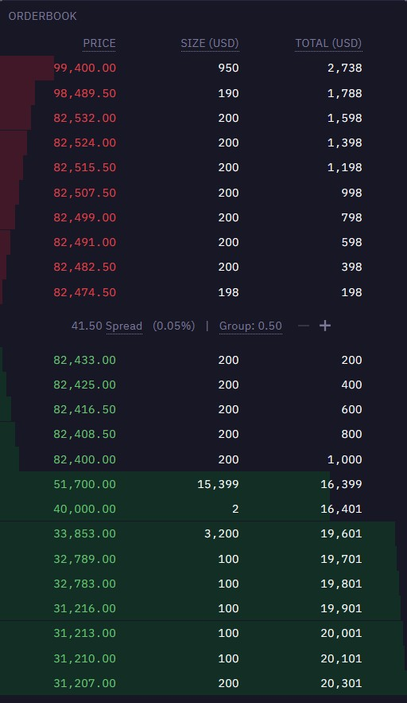

## {background-image="front.png"}

# about me

Software and Data Engineering Freelancer

[mail@eugengeist.com](mail@eugengeist.com)

[https://eugengeist.com](https://eugengeist.com)

# agenda

- motivation
- fundamental trading concepts and market mechanics
- functional and non-functional requirements
- market data ingestion and processing
- order management and execution
- implementation of trading strategies
- post-trade analysis
- outlook

# motivation

## money

## easy access to markets

## more control and flexibility

## interesting exercise with different technical challenges

## job opportunities

# fundamental trading concepts

## trading
>the activity of buying and selling things[^1]

[^1]:_[Oxford Learners Dictionary, accessed 2025-03-02, 20:40](https://www.oxfordlearnersdictionaries.com/definition/american_english/trading?q=trading)_

- buying apples for pears
- selling stocks for money
- buying eth coin for bitcoin

## exchange
>An exchange may be a physical location where traders meet to conduct business or an electronic platform.[^2]

[^2]: _[Investopedia, accessed 2025-03-04, 20:30](https://www.investopedia.com/terms/e/exchange.asp)_

- also called market
- weekly markets in city center
- stock exchange
- crypto exchange

## algorithmic trading
> trading on international stock exchanges using computers that have been programmed to buy and sell shares according to fixed rules[^4]

[^4]:_[Collins dictionary, accessed 2025-03-04, 20:40](https://www.collinsdictionary.com/de/worterbuch/englisch/algorithmic-trading)_

- also used for trading crypto or commodities (e.g. electricity)

## orderbook
>... order book refers to an electronic list of buy and sell orders for a specific security or financial instrument organized by price level.[^3]

[^3]: _[Investopedia, accessed 2025-03-04, 20:30](https://www.investopedia.com/terms/o/order-book.asp)_

- order: offer to buy or sell - consists usually of
    - price for one unit
    - amount
    - identifier

---
{ width=40% height=40% }

## trades and positions
- **trade**: an order that was *executed* -> somebody else matched your order and you actually bought/sold a good
- **position**: accumulation of all trades for one specific good -> how much do I actually have of a good

## summary
- order: sell or buy offer
- orderbook: list of sell and buy offers for one good
- trade: I bought/sold a good for a price
- position: How much I have of a good

# functional and non-functional requirements

# market data ingestion and processing

# order management and execution

# implementation of trading strategies

# post-trade analysis

# outlook