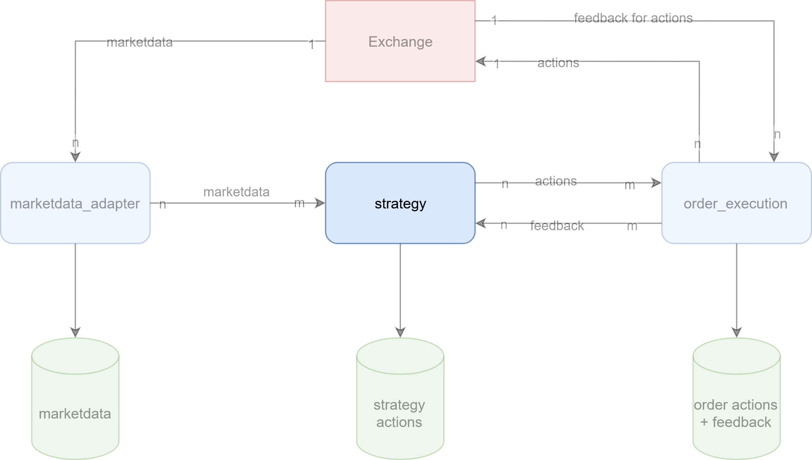

## {background-image="img/front.png"}

# about me
:::::::::::::: {.columns}
::: {.column width="50%"}
{width=75%}
:::
::: {.column width="50%"}
- Software and Data Engineering Freelancer
  - ~5 years of experience in exchange trading
  - other industries: Infrastructure, automotive, logistics
- contact 
  - [mail@eugengeist.com](mail@eugengeist.com)
  - [linkedin.com/in/eugen-geist/](linkedin.com/in/eugen-geist/)
:::
::::::::::::::

# agenda

- motivation
- fundamental trading concepts
- functional and non-functional requirements
- implementation of trading strategies
- component communication
- marketdata ingestion and processing
- order management and execution
- data storage and post-trade analysis
- outlook

# motivation

## money

## easy access to markets

## more control and flexibility

## interesting exercise with different technical challenges

## job opportunities

## self-made is always better ( ;) )

# fundamental trading concepts

## trading
>the activity of buying and selling things[^1]

[^1]:_[Oxford Learners Dictionary, accessed 2025-03-02, 20:40](https://www.oxfordlearnersdictionaries.com/definition/american_english/trading?q=trading)_

- buying apples for pears
- selling stocks for money
- buying eth coin for bitcoin

## exchange
>An exchange may be a physical location where traders meet to conduct business or an electronic platform.[^2]

[^2]: _[Investopedia, accessed 2025-03-04, 20:30](https://www.investopedia.com/terms/e/exchange.asp)_

- also called market
- weekly markets in city center
- stock exchange
- crypto exchange

## algorithmic trading
> trading on international stock exchanges using computers that have been programmed to buy and sell shares according to fixed rules[^4]

[^4]:_[Collins dictionary, accessed 2025-03-04, 20:40](https://www.collinsdictionary.com/de/worterbuch/englisch/algorithmic-trading)_

- also used for trading crypto or commodities (e.g. electricity)
- usually use orders and orderbooks for trading

## orderbook
>... order book refers to an electronic list of buy and sell orders for a specific security or financial instrument organized by price level.[^3]

[^3]: _[Investopedia, accessed 2025-03-04, 20:30](https://www.investopedia.com/terms/o/order-book.asp)_

- order: offer to buy or sell - consists usually of
    - price for one unit
    - amount
- orderbook: list of all orders for one specific good
- orderbook level: aggregated quantity of all orders for one price

---


## trades and positions
- **trade**: an order that was *executed* ➡️ somebody else matched your order and you actually bought/sold a good
- **position**: accumulation of all trades for one specific good ➡️ how much do I actually have of a good

## summary

- order: sell or buy offer
- orderbook: list of sell and buy offers for one good
- trade: I bought/sold a good for a price
- position: how much I have of a good
- instrument: traded good

# functional and non-functional requirements

## functional requirements
I want to

- be able to trade instruments with different algorithms on an exchange 
- get insights about how I traded 
- improve my trading systematically

## non-functional requirements
I want to

- trade 
  - on different exchanges (extensibility + scalability)
  - multiple instruments (scalability)
  - using different approaches/algorithms (Extensibility + scalability)
- have recordings about performed actions (Transparency + Compliance)
- be sufficiently fast to trade properly (Performance + Throughput)

## technical requirements
I need for trading

- an API to receive marketdata to know what happens
- an API to send orders to exchange to trade
- an API to receive feedback about orders and trades
- to structure my components independently to connect them in multiple ways

---

I need for having records about performed actions

- to store what I did (orders, decisions)
- to store what my actions triggered (trades, order cancellations)
- to store what happens on the market (marketdata)

---

I need for being sufficiently fast to

- structure my components independently to scale them
- pick fast technologies
- pick a location as close as possible to the exchanges (if possible)

---

{ width=80% }

# disclaimer

this is a proof of concept. 

it shall demonstrate the typical architecture and components of a trading system.

in real world scenarios, with a bigger team and more resources you might use other approaches, especially faster technology.

---

due to low-barrier access, a crypto exchange - Kraken futures[^5] - was used for the proof of concept.

most exchanges have a simulation environment, that can be used for testing - also Kraken futures[^6].

[^5]: _[Kraken futures, accessed 2025-04-12, 18:15](https://www.kraken.com/features/futures)_
[^6]: _[Kraken futures simulation environment, accessed 2025-04-12, 18:20](https://demo-futures.kraken.com/futures)_

# implementation of trading strategies

---

{ width=80% }

---

## trading strategies or algorithms

- based on a signal a decision is made to act on a market
- most important signals, that need to be provided
  - marktdata
  - feedback for own orders
  - own position
  - for derivatives: data of underlying assets (live or forecasts)
- needs to be able to execute wanted actions on a market ➡️ *order actions*

## implementation

- most of the time it makes sense to have one trading strategy instance per traded instrument as
  - orderbooks are separated per instrument
  - orders are sent per instrument
- to make decisions, trading strategy should keep track of 
  - marketdata/orderbook of traded instrument ➡️ requires marketdata from exchange and book-building
  - own active orders ➡️ requires feedback for sent orders
  - own position/exposure ➡️ requires feedback for sent orders
- to be able to act, trading strategies require need an interface to send order actions

---

### subscription to marketdata with callbacks

```python
def subscribe_orderbook_data(
    *,
    product_ids: set[str],
    on_trade: Callable[[TradeSnapshot | TradeDelta], None],
    on_orderbook_event: Callable[[BookSnapshot | BookDelta], None],
):
    ...
```

---

### interface to send orders
:::::::::::::: {.columns align=center}
::: {.column width="50%"}

```python
def send_new_order_to_execution_engine(
    *,
    sender_identifier: str,
    product_id: str,
    side: OrderbookSide,
    order_type: OrderType,
    size: Decimal,
    limit_price: Decimal,
    stop_price: Decimal | None = None,
) -> str:
    ...


def send_cancel_order_to_execution_engine(
    *,
    sender_identifier: str,
    product_id: str,
    client_order_id: str,
    order_id: str | None = None,
):
    ...
```
:::
::: {.column width="50%"}
```python
def send_modify_order_to_execution_engine(
    *,
    sender_identifier: str,
    product_id: str,
    client_order_id: str,
    order_id: str | None = None,
    process_before: dt.datetime | None = None,
    size: Decimal | None = None,
    limit_price: Decimal | None = None,
    stop_price: Decimal | None = None,
):
    ...


```
:::
::::::::::::::

# component communication

--- 

{ width=80% }

---

- to allow for redundancy: horizontal scaling
- horizontal scaling requires communication via network (otherwise unix sockets might have been an option)
- to send something via network it has to be serialized

## serialization

::: notes

- of course also a lot more possibilities exist

:::

> the basic mechanisms are to flatten object(s) into a one-dimensional stream of bits, and to turn that stream of bits back into the original object(s). [^9]

[^9]: _[Serialization, accessed 2025-04-13, 16:40](https://isocpp.org/wiki/faq/serialization)_

possible candidates

- json
- protocol buffers (protobuf)
- flatbuffers
- msgpack
- pickle
- proprietary

---

## communication

::: notes

- of course also a lot more possibilities exist

:::
> how to send serialized data over network to other component

possible candidates

- proprietary tcp
- proprietary udp (also multicast)
- REST (HTTP)
- gRPC (requires protobuf as serialization)
- event streaming or message broker (kafka, rabbitmq, ...)
- database (postgres, mysql, ...)

## messagepack via kafka

## why kafka

::: notes

- more in-depth reasons in Github repo of presentation

:::

- fast
- established
  - support in all (big) programming languages exist ➡️ consumer and producer are language independent (used kafka-python[^10])
  - can be used as managed service in cloud
  - many people with experience ➡️ easier to hire
- resilient
- messages can be replayed
- scalable: n producers to m consumers
  - allows storing messages with separate consumer
  - allows multiple producers on same channel (topic) for failovers
- does not require specific serialization
- disadvantages: 
  - no built-in mechanism to check whether consumers are gone
  - has to be operated as a separate service

[^10]: _[kafka-python, accessed 2025-04-13 16:50](https://github.com/dpkp/kafka-python)_

## why messagepack

::: notes

- of course not established as JSON
- biggest reason against JSON: size
- more in-depth reasons in Github repo of presentation

:::

- allows conversion of arbitrary objects to bytes and back
- schemalass (e.g. in contrast to protobuf)
- fast
- established
  - support in all (big) programming languages exist (used ormsgpack[^11] for python)
  - backed and used by big products like redis, fluentd, pinterest

[^11]: _[ormsgpack, accessed 2025-04-13 16:50](https://github.com/aviramha/ormsgpack)_

## resulting architecture

![[^12]](img/high_level_architecture_kafka.png){ width=80% }

[^12]: _[kafka logo, accessed 2025-04-13 17:51](https://de.m.wikipedia.org/wiki/Datei:Apache_Kafka_logo.svg)_


# marketdata ingestion and processing

---

{ width=80% }

---

## general

- also called public data
- one orderbook per traded instrument
- essential for implementing trading strategies as current prices and quantities are provided
- mostly available as unidirectional data streams (e.g. via websockets, TCP or UDP)
- different types of data
  - **level 1** (or top of book) data: currently best buy (highest) and sell (lowest) offer
  - **level 2** data: excerpt from orderbook with top n levels
  - **level 3** (or tick-by-tick or order-by-order) data: each order and its state (placed, changed, removed)
  - usually also information about trades
- level 3 data contains the most detail, but also has highest volume and is usually most expensive

---


## marketdata ingestion

- trading strategies should be use-able on different exchanges
- different exchanges have different marketdata protocols
- decoupling of trading system from exchanges by normalizing marketdata to internal format via adapter pattern[^7]

[^7]: _[Adapter design pattern, accessed 2025-04-12, 19:40](https://refactoring.guru/design-patterns/adapter)_

---

## ➡️ marketdata adapter

- per exchange
  - receives marketdata from exchanges 
  - normalizes marketdata to internal representation
- forwards normalized marketdata to strategies


## Kraken derivatives marketdata adapter

- subscribes to marketdata for different instruments
  - via websocket
  - exchange sends JSON (use orjson[^8] for fast parsing)
- L2 marketdata ➡️ orderbook levels
  - on connect a _snapshot_ is received: the whole orderbook 
  - consecutive messages are _deltas_: what changes to levels ocurred compared to previous message
- received marketdata is processed and sent to strategies
  - not only transformation, but also keeps track of orderbooks
  - sends each N minutes a snapshot to the strategies

[^8]: _[orjson, accessed 2025-04-13 15:40](https://github.com/ijl/orjson)_

---

### Snapshot message
::: notes

if somebody knows how to center this arrow in pandoc, please write me a message

:::

:::::::::::::: {.columns align=center}
::: {.column width="35%"}
kraken futures
```json
{
    "feed": "book_snapshot",
    "product_id": "PI_ETHUSD",
    "timestamp": 1744550040435,
    "seq": 528862,
    "tickSize": null,
    "bids": [
        {
            "price": 1556.2,
            "qty": 200.0
        },
    ],
    ...
    "asks": [
        {
            "price": 1556.825,
            "qty": 184.0
        },
        ...
    ]
}
```
:::
::: {.column width="5%"}
➡️
:::
::: {.column width="60%"}
internal representation
```python
class BaseMessage(BaseModel):
    message_type: MessageType

    
class BookBase(BaseMessage):
    timestamp: int
    seq: int
    product_id: str
    
    
class OrderBookEntry(BaseModel):
    price: Decimal
    qty: Decimal

    
class BookSnapshot(BookBase):
    message_type: MessageType = MessageType.BOOK_SNAPSHOT
    tickSize: Optional[Decimal]
    bids: list[OrderBookEntry]
    asks: list[OrderBookEntry]


```
:::
::::::::::::::

---

### Delta message

:::::::::::::: {.columns align=center}
::: {.column width="35%"}
kraken futures
```json
{
    "feed": "book",
    "product_id": "PI_ETHUSD",
    "side": "sell",
    "seq": 533776,
    "price": 1596.8,
    "qty": 200.0,
    "timestamp": 1744551637145
}
{
    "feed": "book",
    "product_id": "PI_ETHUSD",
    "side": "sell",
    "seq": 533777,
    "price": 1595.7,
    "qty": 0.0,
    "timestamp": 1744551641794
}
```
:::
::: {.column width="5%"}
➡️
:::
::: {.column width="60%"}
internal representation
```python
class BaseMessage(BaseModel):
    message_type: MessageType

class BookBase(BaseMessage):
    timestamp: int
    seq: int
    product_id: str
    
class OrderbookSide(StrEnum):
    BUY = "buy"
    SELL = "sell"
    
class BookDelta(BookBase):
    message_type: MessageType = MessageType.BOOK
    side: OrderbookSide
    price: Decimal
    qty: Decimal


```
:::
::::::::::::::


# order management and execution

---

{ width=80% }

---

## sending orders

- trading strategies should be able to send orders to different exchanges
- different exchanges have different protocols for sending orders
- decoupling of trading system from exchanges by normalizing order sending via adapter pattern[^7]

## general order execution

- also sometimes called private data
- bidirectional - either send/receive via same or separate channels
  - proprietary TCP
  - input via HTTP/REST, feedback via websocket

## ➡️ order execution engine

- similar to marketdata adapter, but for outgoing orders (adapter pattern used) 
- receives normalized order action from strategy
- per exchange
  - converts normalized order action to exchange format
  - sends order action to exchange
  - receives order feedback from exchange
  - normalizes order feedback from exchange
- sends order action feedback to strategy

## order actions

- depending on order type and market, order actions and feedback can vary
- common order actions for orderbook trading
  - place new order
  - modify order price or quantity of active order
  - cancel active order
- common feedback for orderbook trading
  - action confirmations
    - new
    - modify
    - cancelled
  - trades, also called fills - order was ful*filled*
  - cancellations by exchange - can occur due to various reasons like market outages or compliance

## Kraken derivatives order execution
::: notes

- rest request response also gives first information about order, but for the feedback completely websocket was used

:::

- placement of orders via REST
  - different endpoints for different actions
  - expects JSON as input
- feedback via websocket or REST polling ➡️ for proof of concept websocket was selected
  - same websocket endpoint as for marketdata adapter
  - on connect a _snapshot_ of the subscribed data is received
  - consecutive messages are _deltas_: what changes to data ocurred compared to previous message
- order actions received from strategies are converted and forwarded to exchange
- feedback received from exchange is normalized and forwarded to strategies

---

### new order request
::: notes

- action_type assignment on next line for better readability

:::
:::::::::::::: {.columns}
::: {.column width="55%"}
```python
class OrderBase(BaseModel):
    action_type: OrderActionType
    sender_id: str = UNKNOWN_SENDER_ID
    product_id: str
    client_order_id: str | None = None


class NewOrder(OrderBase):
    action_type: OrderActionType = 
        OrderActionType.NEW_ORDER
    side: OrderbookSide
    order_type: OrderType
    size: Decimal
    limit_price: Decimal
    stop_price: Decimal | None = None


```
:::
::: {.column width="5%"}
➡️
:::
::: {.column width="40%"}
```
orderType=lmt&symbol=PI_XBTUSD&
side=buy&size=1&limitPrice=84389.0
&cliOrdId=...
```
OR
```json
{
  "orderType": "lmt",
  "symbol": "PI_XBTUSD",
  "side": "buy",
  "size": 1,
  "limitPrice": 84389.0, 
  "cliOrdId": "..."
}
```
:::
::::::::::::::

---

### fill response message 

::: notes

- response_type assignment on next line for better readability

:::
:::::::::::::: {.columns}
::: {.column width="40%"}
kraken futures
```json
{
    "feed": "fills",
    "username": "...",
    "fills": [
        {
            "instrument": "PI_XBTUSD",
            "time": 1744729661598,
            "price": 84889.0,
            "seq": 100,
            "buy": true,
            "qty": 1.0,
            "remaining_order_qty": 0.0,
            "order_id": "...",
            "cli_ord_id": "...",
            "fill_id": "...",
            "fill_type": "taker",
            "fee_paid": 5.9e-09,
            "fee_currency": "BTC",
            "taker_order_type": "lmt",
            "order_type": "lmt"
        }
    ]
}
```

:::
:::{.column width="5%"}
➡️
:::
:::{.column width="55%"}
internal representation
```python
class OrderResponse(BaseModel):
    response_type: OrderActionType
    sender_id: str = UNKNOWN_SENDER_ID
    product_id: str
    client_order_id: str | None = None
    order_id: str
    side: OrderbookSide
    size: Decimal
    price: Decimal

class Fill(OrderResponse):
    response_type: OrderActionType = 
        OrderActionResponseType.FILL
    time: int
    fill_id: str
    remaining_size: Decimal


    
    
    
    


```
:::
::::::::::::::

---

## order handling caveats

- order actions can fail for various reasons
  - cancel for already filled order
  - modify for already filled order
  - modify for already cancelled order (by exchange)
- due to distributed nature and latency to exchange, strategies might react too late ➡️ low latency helps up to a certain point
- most exchanges have rate limits
  - limit possible actions per time period
  - punish you if you try too often to violate them
  - ➡️ paying more for higher rate limits or multiple accounts might help (if allowed)
- order execution engine can also keep track of orders to 
  - act proactively (e.g. don't send cancel for filled order)
  - keep track of rate limits and allow cancels in emergencies

# data storage and post-trade analysis

---

{ width=80% }

---

## characteristics - what is the data needed for?

Differentiation mainly comes down to usage

:::::::::::::: {.columns}
::: {.column width="50%"}
during live trading

- data volume low, because only most recent state is relevant
- fast write and read access needed
- data changes over time
- example: 
  - current strategy positions
  - current active orders
  - global risk exposure
:::

::: {.column width="50%"}
outside of live trading

- data volume high, because 
- fast read access is needed based on filter criteria
- data does not change anymore
- examples
  - backtesting with marketdata
  - post-trading analysis own trades 
:::
::::::::::::::

## live trading

- use of RDBMS ➡️ Postgres
  - write most recent states as rows to database 
  - retrieve only most recent rows e.g. by update time
  - biggest disadvantage: one more service to operate
- use of kafka
  - publish most recent state regularly
  - read most recent n messages and process to find desired state
  - biggest disadvantage: retrieval might get finicky in a system with a lot of participants
- TODO: add what was used for poc

## outside of live trading

- different types of consumers ➡️ format must be language agnostic
- different types of data ➡️ format must be flexible
- big volume of data ➡️ format must support compression

. . .

:::::::::::::: {.columns}
::: {.column width="40%"}
:::
::: {.column width="20%"}
➡️ **parquet**
:::
::: {.column width="40%"}
:::
::::::::::::::

- de-facto standard for longterm storage of big data volumes
- supported by all big analysis systems and programming languages

---

### implementation

- retention time of kafka topics high enough (e.g. 3 days to have safety buffer)
- scheduled run of data dumper on a regular basis - after trading day passed
  - reads kafka topic
  - dumps data payload parquet
- different data dumpers for
  - marketdata (internal format!)
  - order actions (new order, modify, cancel)
  - order feedback (acknowledgements, cancel)
  - trades/fills

# outlook

## technical

::: notes

- strategies reacting too fast for markets can lead to bad trading results

:::

- **implement configurations** - e.g. which marketdata and which order execution adapter to use
- **software tests**: very important as software can lose very fast a lot of money
  - unit and integration  tests
  - [infamous knight capital case of $440 million software error](https://www.henricodolfing.com/2019/06/project-failure-case-study-knight-capital.html)
- **logging and alerting**
- **where to host?** ➡️ depends on market type and market itself
  - finance: mostly hosted on-prem in data-centers around the world close to the exchanges
  - crypto: mostly in clouds close to crypto exchanges
- **emergency mechanisms**
  - how to handle failures of single components?
  - how to handle global risk management?
  - ...
  - ➡️ often better not to trade, than to trade wrong
- **fine-tuning depending on markets**
  - timing and latency of order and strategy actions
  - storage and retention

## business

- **understanding markets**
  - order types and matching mechanisms differ ➡️ marketdata and execution engine implementations may differ
  - types of traders and grade of professionalization differ
  - latency requirements differ
- **compliance**
  - different markets have different barriers to entry
  - filing taxes
  - depending on market regulations paper-trail is needed: which trade was done with which version of which software?

# repo
https://github.com/e-geist/ddtp