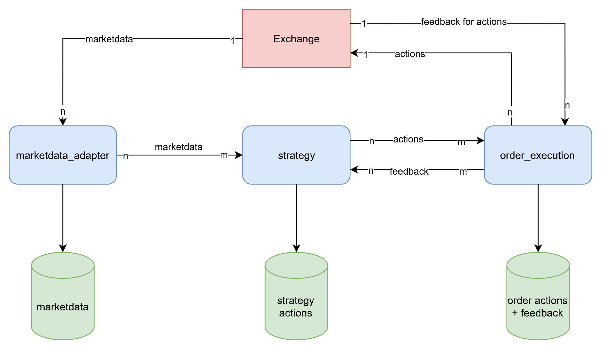
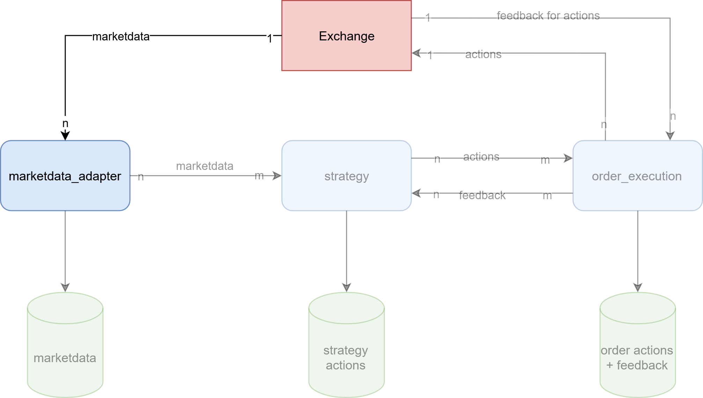

## {background-image="front.png"}

# about me
:::::::::::::: {.columns}
::: {.column width="50%"}
{width=75%}
:::
::: {.column width="50%"}
- Software and Data Engineering Freelancer
  - ~5 years of experience in exchange trading
  - other industries: Infrastructure, automotive, logistics
- contact 
  - [mail@eugengeist.com](mail@eugengeist.com)
  - [linkedin.com/in/eugen-geist/](linkedin.com/in/eugen-geist/)
:::
::::::::::::::

# agenda

- motivation
- fundamental trading concepts and market mechanics
- functional and non-functional requirements
- market data ingestion and processing
- serialization and component communication
- order management and execution
- implementation of trading strategies
- post-trade analysis
- outlook

# motivation

## money

## easy access to markets

## more control and flexibility

## interesting exercise with different technical challenges

## job opportunities

## self-made is always better ( ;) )

# fundamental trading concepts

## trading
>the activity of buying and selling things[^1]

[^1]:_[Oxford Learners Dictionary, accessed 2025-03-02, 20:40](https://www.oxfordlearnersdictionaries.com/definition/american_english/trading?q=trading)_

- buying apples for pears
- selling stocks for money
- buying eth coin for bitcoin

## exchange
>An exchange may be a physical location where traders meet to conduct business or an electronic platform.[^2]

[^2]: _[Investopedia, accessed 2025-03-04, 20:30](https://www.investopedia.com/terms/e/exchange.asp)_

- also called market
- weekly markets in city center
- stock exchange
- crypto exchange

## algorithmic trading
> trading on international stock exchanges using computers that have been programmed to buy and sell shares according to fixed rules[^4]

[^4]:_[Collins dictionary, accessed 2025-03-04, 20:40](https://www.collinsdictionary.com/de/worterbuch/englisch/algorithmic-trading)_

- also used for trading crypto or commodities (e.g. electricity)
- usually use orders and orderbooks for trading

## orderbook
>... order book refers to an electronic list of buy and sell orders for a specific security or financial instrument organized by price level.[^3]

[^3]: _[Investopedia, accessed 2025-03-04, 20:30](https://www.investopedia.com/terms/o/order-book.asp)_

- order: offer to buy or sell - consists usually of
    - price for one unit
    - amount
    - identifier
- orderbook: list of all orders for one specific good
- orderbook level: aggregated quantity of all orders for one price

---


## trades and positions
- **trade**: an order that was *executed* ➡️ somebody else matched your order and you actually bought/sold a good
- **position**: accumulation of all trades for one specific good ➡️ how much do I actually have of a good

## summary
- order: sell or buy offer
- orderbook: list of sell and buy offers for one good
- trade: I bought/sold a good for a price
- position: How much I have of a good


# functional and non-functional requirements

## functional requirements
I want to

- be able to trade goods with different algorithms on an exchange 
- get insights about how I traded 
- improve my trading systematically

## non-functional requirements
I want to

- trade 
  - on different exchanges (Extensibility + Scalability)
  - multiple goods (Scalability)
  - using different (Extensibility + Scalability)
- have recordings about performed actions (Transparency + Compliance)
- be sufficiently fast to trade properly (Performance + Throughput)

## technical requirements
I need for trading

- an API to receive marketdata to know what happens
- an API to send orders to exchange to trade
- an API to receive feedback about orders and trades
- to structure my components independently to connect them in multiple ways

---

I need for having records about performed actions

- to store what I did (orders, decisions)
- to store what my actions triggered (trades, order cancellations)
- to store what happens on the market (marketdata)

---

I need for being sufficiently fast to

- structure my components independently to scale them
- pick fast technologies
- pick a location as close as possible to the exchanges (if possible)

---

{ width=80% }

# disclaimer

this is a proof of concept. 

it shall demonstrate the typical architecture and components of a trading system.

in real world scenarios, with a bigger team and more resources you might use other approaches, especially faster technology.

---

due to low-barrier access, a crypto exchange - Kraken futures[^5] - was used for the proof of concept.

most exchanges have a simulation environment, that can be used for testing - also Kraken futures[^6].

[^5]: _[Kraken futures, accessed 2025-04-12, 18:15](https://www.kraken.com/features/futures)_
[^6]: _[Kraken futures simulation environment, accessed 2025-04-12, 18:20](https://demo-futures.kraken.com/futures)_

# marketdata ingestion and processing

---

{ width=80% }

---

## general

- also called public data
- one orderbook per traded good
- essential for implementing trading strategies as current prices and quantities are provided
- mostly available as data streams (e.g. via websockets, TCP or UDP)
- different types of data
  - **level 1** (or top of book) data: currently best buy (highest) and sell (lowest) offer
  - **level 2** data: excerpt from orderbook with top n levels
  - **level 3** (or tick-by-tick or order-by-order) data: each order and its state (placed, changed, removed)
  - usually also information about trades
- level 3 data contains the most detail, but also has highest volume and is usually most expensive

---


## marketdata ingestion

- trading strategies should be use-able on different exchanges
- different exchanges have different marketdata protocols
- decoupling of trading system from exchanges by normalizing marketdata to internal format via adapter pattern[^7]

[^7]: _[Adapter design pattern, accessed 2025-04-12, 19:40](https://refactoring.guru/design-patterns/adapter)_

---

## ➡️ marketdata adapter

- per exchange
  - receives marketdata from exchanges 
  - normalizes marketdata to internal representation
- forwards normalized marketdata to strategies


## Kraken derivatives marketdata adapter

- subscribes to marketdata for different instruments
  - via websocket
  - exchange sends JSON (use orjson[^8] for fast parsing)
- L2 marketdata ➡️ orderbook levels
  - on connect a _snapshot_ is received: the whole orderbook 
  - consecutive messages are _deltas_: what changes to levels ocurred compared to previous message
- received marketdata is processed and sent to strategies
  - not only transformation, but also keeps track of orderbooks
  - sends each N minutes a snapshot to the strategies

[^8]: _[orjson, accessed 2025-04-13 15:40](https://github.com/ijl/orjson)_

---

### Snapshot message
::: notes

if somebody knows how to center this arrow in pandoc, please write me a message

:::

:::::::::::::: {.columns align=center}
::: {.column width="35%"}
kraken futures
```json
{
    "feed": "book_snapshot",
    "product_id": "PI_ETHUSD",
    "timestamp": 1744550040435,
    "seq": 528862,
    "tickSize": null,
    "bids": [
        {
            "price": 1556.2,
            "qty": 200.0
        },
    ],
    ...
    "asks": [
        {
            "price": 1556.825,
            "qty": 184.0
        },
        ...
    ]
}
```
:::
::: {.column width="5%"}
➡️
:::
::: {.column width="60%"}
internal representation
```python
class BaseMessage(BaseModel):
    message_type: MessageType

    
class BookBase(BaseMessage):
    timestamp: int
    seq: int
    product_id: str
    
    
class OrderBookEntry(BaseModel):
    price: Decimal
    qty: Decimal

    
class BookSnapshot(BookBase):
    message_type: MessageType = MessageType.BOOK_SNAPSHOT
    tickSize: Optional[Decimal]
    bids: list[OrderBookEntry]
    asks: list[OrderBookEntry]


```
:::
::::::::::::::

---

### Delta message

:::::::::::::: {.columns align=center}
::: {.column width="35%"}
kraken futures
```json
{
    "feed": "book",
    "product_id": "PI_ETHUSD",
    "side": "sell",
    "seq": 533776,
    "price": 1596.8,
    "qty": 200.0,
    "timestamp": 1744551637145
}
{
    "feed": "book",
    "product_id": "PI_ETHUSD",
    "side": "sell",
    "seq": 533777,
    "price": 1595.7,
    "qty": 0.0,
    "timestamp": 1744551641794
}
```
:::
::: {.column width="5%"}
➡️
:::
::: {.column width="60%"}
internal representation
```python
class BaseMessage(BaseModel):
    message_type: MessageType

class BookBase(BaseMessage):
    timestamp: int
    seq: int
    product_id: str
    
class OrderbookSide(StrEnum):
    BUY = "buy"
    SELL = "sell"
    
class BookDelta(BookBase):
    message_type: MessageType = MessageType.BOOK
    side: OrderbookSide
    price: Decimal
    qty: Decimal


```
:::
::::::::::::::

# serialization and component communication

--- 

{ width=80% }

---

- to allow for redundancy: horizontal scaling
- horizontal scaling requires communication via network (otherwise unix sockets might have been an option)
- to send something via network it has to be serialized

## serialization

::: notes

- of course also a lot more possibilities exist

:::

> the basic mechanisms are to flatten object(s) into a one-dimensional stream of bits, and to turn that stream of bits back into the original object(s). [^9]

[^9]: _[Serialization, accessed 2025-04-13, 16:40](https://isocpp.org/wiki/faq/serialization)_

possible candidates

- json
- protocol buffers (protobuf)
- flatbuffers
- msgpack
- pickle
- proprietary

---

## communication

::: notes

- of course also a lot more possibilities exist

:::
> how to send serialized data over network to other component

possible candidates

- proprietary tcp
- proprietary udp (also multicast)
- REST (HTTP)
- gRPC (requires protobuf as serialization)
- event streaming or message broker (kafka, rabbitmq, ...)
- database (postgres, mysql, ...)

## msgpack via kafka

## why kafka

::: notes

- more in-depth reasons in Github repo of presentation

:::

- fast
- established
  - support in all (big) programming languages exist ➡️ consumer and producer are language independent
  - can be used as managed service
  - many people with experience ➡️ easier to hire
- resilient
- messages can be replayed
- scalable: n producers to m consumers
  - allows storing messages with separate consumer
  - allows multiple producers on same channel (topic) for failovers
- does not require specific serialization
- disadvantages: 
  - no built-in mechanism to check whether consumers are gone
  - has to be operated as a separate service

## why msgpack

::: notes

- of course not established as JSON
- biggest reason against JSON: size
- more in-depth reasons in Github repo of presentation

:::

- allows conversion of arbitrary objects to bytes and back
- schemalass (e.g. in contrast to protobuf)
- fast
- established
  - support in all (big) programming languages exist ➡️ consumer and producer are language independent
  - backed and used by big products like redis, fluentd, pinterest


## resulting architecture

![[^10]](high_level_architecture_kafka.png){ width=80% }

[^10]: _[kafka logo, accessed 2025-04-13 17:51](https://de.m.wikipedia.org/wiki/Datei:Apache_Kafka_logo.svg)_

# order management and execution

# implementation of trading strategies

# post-trade analysis

# outlook